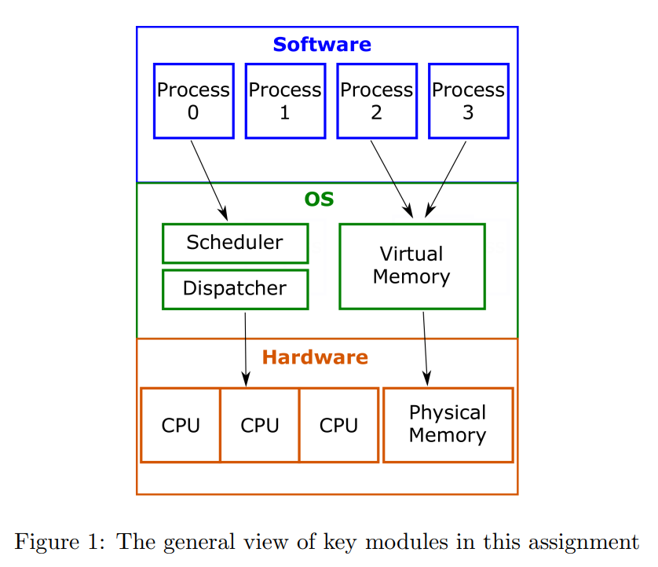

# Operating-Systems-Simulation-HCMUT
## 1.  Introduction
### 1.1 An overview
The assignment is about simulating a simple operating system to help me understand the fundamental concepts of scheduling, synchronization and memory management. Figure 1 shows the overall architecture of the operating system that I'm going to implement. Generally, the OS has to manage two virtual resources:
CPU(s) and RAM using two core components:
- Scheduler (and Dispatcher): determines which process is allowed to run on which CPU.
- Virtual memory engine (VME): isolates the memory space of each process from other. The physical RAM is shared by multiple processes but each process do not know the existence of other. This is done by letting each process has its own virtual memory space and the Virtual memory engine will map and translate the virtual addresses provided by processes to corresponding physical addresses.

Through those modules, the OS allows mutliple processes created by users to share and use the virtual computing resources. Therefore, in this assignment, we focus on implementing scheduler/dispatcher and virtual memory engine.

### 1.2 Source Code
- **Header files**:
  - *timer.h*: Define the timer for the whole system.
  - *cpu.h*: Define functions used to implement the virtual CPU
  - *queue.h*: Functions used to implement queue which holds the PCB of processes
  - *sched.h*: Define functions used by the scheduler
  - *mem.h*: Functions used by Virtual Memory Engine
  - *loader.h*: Functions used by the loader which load the program from disk to memory
  - *common.h*: Define structs and functions used everywhere in the OS.
  - *bitopts.h*: Define operations on bit data.
  - *os-mm.h, mm.h*: Define the structure and basic data for Paging-based Memory Management.
  - *os-cfg.h*: (Optional) Define contants use to switch the software configuration.
- **Source files**
  - *timer.c*: Implement the timer.
  - *cpu.c*: Implement the virtual CPU.
  - *queue.c*: Implement operations on (priority) queues.
  - *paging.c*: Use to check the functionality of Virtual Memory Engine.
  - *os.c*: The whole OS starts running from this file.
  - *loader.c*: Implement the loader
  - *sched.c*: Implement the scheduler
  - *mem.c*: Implement RAM and Virtual Memory Engine
  - *mm.c, mm-vm.c, mm-memphy.c*: Implement Paging-based Memory Management
- Makefile
- input: Samples input used for verification
- output: Samples output of the operating system
  
### 1.3 The overview of operations of the Scheduler:

### 1.4 The overview of operations of the Virtual Memory Engine

## 2. How to run ?
**Start from your terminal (be sure that your terminal now is in project and at the same level(folder) with *Makefile*), type these command in order:**
1. `make all` to create executable file (*os.exe*)
2. `./os [configure_file]` where *configure_file* is the path to configure file for the evironment on which you want to run and it shoul associated with the name of a description file placed placed in *input* directory.
## 3. Details of OS:
You can get all detail information about this simulated Operating System in this link: [Simple Operating System](https://drive.google.com/file/d/1WPQA59ASUtBI67D1BpzVBXoT15CpeUUb/view?usp=drive_link)
## 4. Report:
You can get all detail report for this assignment here: [My report](https://docs.google.com/document/d/1cGnSNtU7JfvyKWbHrz1yEezvlokUdsDNwF7VY8HQa-k/edit?usp=sharing)
